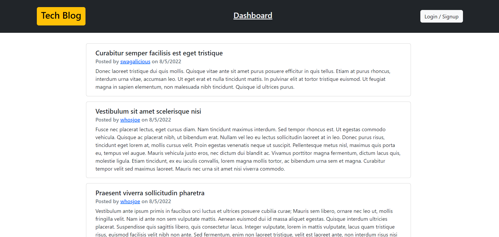
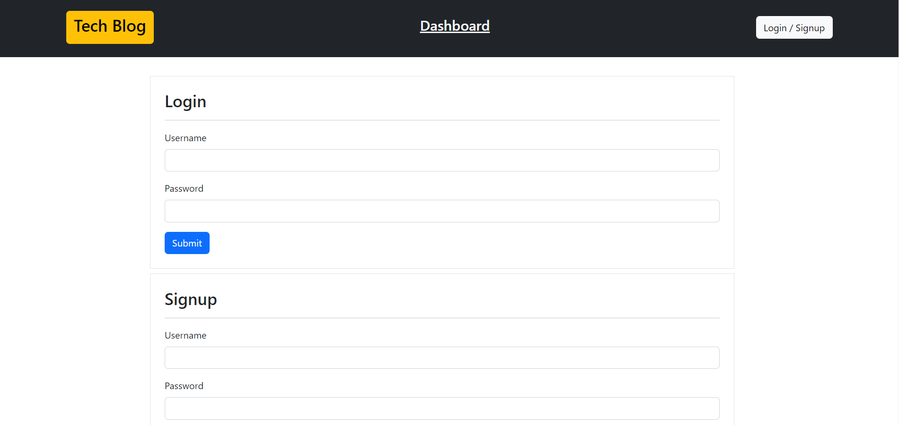
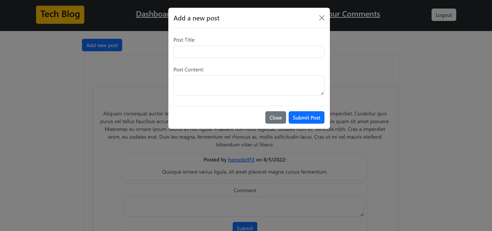
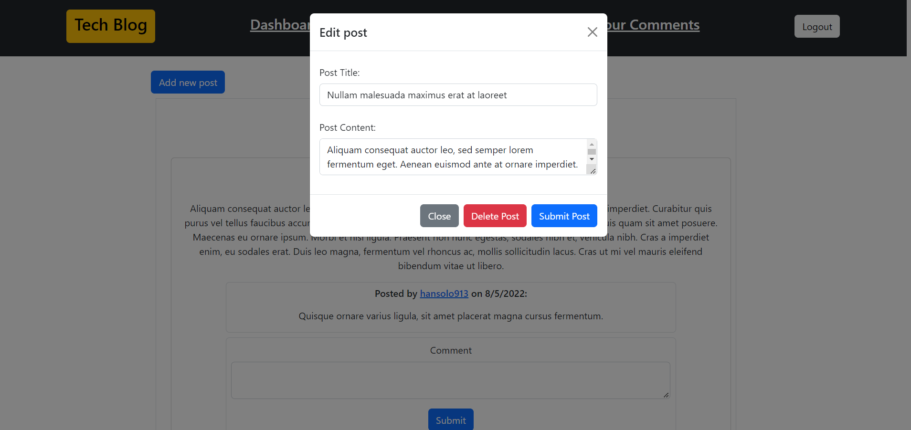

# Tech Blog

[](#license)

A full-stack website for basic blog posting and commenting.

## Description 

This project is a full-stack website for a CMS style blog where users can add, edit and delete posts as well as comment on posts. It uses Express to create a functional API that performs CRUD operations on a database. The database and its models and associations are created with MySQL and Sequelize. The front-end is built using Handlebars.js template engine with Bootstrap as the front-end library.

Link to deployed [site](https://protected-harbor-12759.herokuapp.com/)

## Table of Contents

* [Installation](#installation)
* [Usage](#usage)
* [Credits](#credits)
* [License](#license)
* [Contributing](#contributing)

## Installation
  - Upload all files or fork this repository to a server with a Node.js runtime environment and a MySQL Server. 
  - Push to heroku using the CLI.
  - To host locally, run `npm -i` from the root directory to install dependencies for this app. 
  - Create a `.env` file in the root directory with this format: 
      ```
      DB_NAME=blog_db
      DB_USER=(your user)
      DB_PASSWORD=(your password)
      ```
  - From the root directory, open MySQL Shell and run `source ./db/schema.sql;` to create the database.
  - Run `npm start` to start the server.
  
## Usage 
Run `npm start` to start the server.

- From the homepage, you can view all posts and their respective users and comments. 
- Click `Login / Signup` to navigate to the login/signup page and create an account.
- Navigate to the dashboard to see an overview of your posts and comments. 
- Click `Your Posts` to see all of your posts and add/edit/delete posts
- Click `Your Comments` to see all of your comments
- Once finished, click `Logout` to logout

Homepage:



Login:



Add Post:



Edit Post:



## Credits
This application was built with the support of the resources and staff of the UCB Full Stack Full Time Coding Bootcamp Summer 2022. 


## License
<details>
  <summary><b>MIT License</b></summary>

```
MIT License

Copyright (c) 2022 seannoh

Permission is hereby granted, free of charge, to any person obtaining a copy
of this software and associated documentation files (the "Software"), to deal
in the Software without restriction, including without limitation the rights
to use, copy, modify, merge, publish, distribute, sublicense, and/or sell
copies of the Software, and to permit persons to whom the Software is
furnished to do so, subject to the following conditions:

The above copyright notice and this permission notice shall be included in all
copies or substantial portions of the Software.

THE SOFTWARE IS PROVIDED "AS IS", WITHOUT WARRANTY OF ANY KIND, EXPRESS OR
IMPLIED, INCLUDING BUT NOT LIMITED TO THE WARRANTIES OF MERCHANTABILITY,
FITNESS FOR A PARTICULAR PURPOSE AND NONINFRINGEMENT. IN NO EVENT SHALL THE
AUTHORS OR COPYRIGHT HOLDERS BE LIABLE FOR ANY CLAIM, DAMAGES OR OTHER
LIABILITY, WHETHER IN AN ACTION OF CONTRACT, TORT OR OTHERWISE, ARISING FROM,
OUT OF OR IN CONNECTION WITH THE SOFTWARE OR THE USE OR OTHER DEALINGS IN THE
SOFTWARE.
```
      
</details>

## Contributing
This project isn't currently acccepting contributions.

## Questions
- View my Github [profile](https://github.com/seannoh)
- Contact me at my [email](mailto:seanoh@ucsb.edu)


